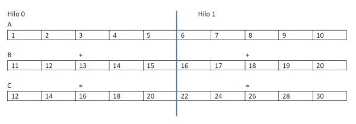

# Actividades

1. Realizar un Hello World y un contador de iteraciones en C, compilarlo y ejercutar
   ```bash
   gcc (o g++) –o HelloWorld HelloWorld.c
   ./HelloWorld
   ```

- Agregar constructor paralelo, compilarlo y ejercutar

  ```C
  #pragma omp parallel
  {
  	...
  }
  ```

  ```bash
  gcc (o g++) –o HelloWorldParallel HelloWorldParallel.c -fopenmp
  ./HelloWorldParallel
  ```

- ¿Qué diferencia hay en la salida? Explique en función del hardware sobre el que está ejecutando el programa.
  La directiva `#pragma omp parallel` indica que el bloque de código siguiente debe ejecutarse en paralelo. La diferencia en la salida radica en que, debido a la directiva OpenMP, el bloque de código dentro del `pragma #pragma omp` parallel se ejecutará en varios hilos simultáneamente. Entonces, las multiples lineas "Hello World" y las iteraciones del bucle se imprimen en un orden no secuencial, ya que varios hilos se ejecutan de manera concurrente y pueden imprimir su salida en un orden intercalado. El orden y la cantidad de lineas pueden variar dependiendo de cómo se maneje la ejecución en el hardware (según el Scheduler) en el que se está ejecutando el programa. Tambien toma relevancia la catidad de núcleos disponibles en el hardware. En sistemas con un solo núcleo, el programa se ejecutará secuencialmente y dará una salida igual a la del primer programa.

2.  En cada región paralela hay un número de hilos generados por defecto y ese número es igual al de unidades de procesamiento que se tengan en la computadora paralela que se esté utilizando, en este caso el número de núcleos que tenga el procesador.
    En el mismo código, cambiar el número de hilos que habrá en la región paralela a un número diferente n (entero), probar cada una de las formas indicadas a continuación. Primero modificar, después compilar y ejecutar nuevamente el programa en cada cambio.
    1. Modificar la variable de ambiente desde la consola de la siguiente forma:
       `export OMP_NUM_THREADS = 4` en Unix y `set OMP_NUM_THREADS=4` en Windows
    ```bash
    Salida por consola (set OMP_NUM_THREADS=4 && .\1_HelloWorldParallel.exe):
    Hello World!
    Iteration: 0
    Iteration: 1
    Iteration: 2
    Iteration: 3
    Iteration: 4
    Iteration: 5
    Iteration: 6
    Iteration: 7
    Iteration: 8
    Iteration: 9
    Hello World!
    Iteration: 0
    Iteration: 1
    Iteration: 2
    Iteration: 3
    Iteration: 4
    Iteration: 5
    Iteration: 6
    Iteration: 7
    Iteration: 8
    Iteration: 9
    Hello World!
    Iteration: 0
    Iteration: 1
    Iteration: 2
    Iteration: 3
    Iteration: 4
    Iteration: 5
    Iteration: 6
    Iteration: 7
    Iteration: 8
    Iteration: 9
    Hello World!
    Iteration: 0
    Iteration: 1
    Iteration: 2
    Iteration: 3
    Iteration: 4
    Iteration: 5
    Iteration: 6
    Iteration: 7
    Iteration: 8
    Iteration: 9
    Bye
    ```
    2. Cambiar el número de hilos a `n` un entero llamando a la función `omp_set_num_threads(n)` que se encuentra en la biblioteca omp.h
    ```bash
    Salida por consola (2_HelloWorldParallel_omp_set_num_threads.exe):
    Hello World!
    Iteration: 0
    Iteration: 1
    Iteration: 2
    Iteration: 3
    Iteration: 4
    Iteration: 5
    Iteration: 6
    Iteration: 7
    Iteration: 8
    Iteration: 9
    Hello World!
    Iteration: 0
    Iteration: 1
    Iteration: 2
    Iteration: 3
    Iteration: 4
    Iteration: 5
    Iteration: 6
    Iteration: 7
    Iteration: 8
    Iteration: 9
    Bye
    ```
    3. Agregar la clúsula `num_threads(n)` seguida después del constructor parallel, esto es: `#pragma omp parallel num_threads(n)`
    ```bash
     Salida por consola (2_HelloWorldParallel_num_threads.exe):
     Hello World!
     Iteration: 0
     Iteration: 1
     Iteration: 2
     Iteration: 3
     Iteration: 4
     Iteration: 5
     Iteration: 6
     Iteration: 7
     Iteration: 8
     Iteration: 9
     Hello World!
     Iteration: 0
     Iteration: 1
     Iteration: 2
     Iteration: 3
     Iteration: 4
     Iteration: 5
     Iteration: 6
     Iteration: 7
     Iteration: 8
     Iteration: 9
     Hello World!
     Iteration: 0
     Iteration: 1
     Iteration: 2
     Iteration: 3
     Iteration: 4
     Iteration: 5
     Iteration: 6
     Iteration: 7
     Iteration: 8
     Iteration: 9
     Bye
    ```
3.  Crear un programa en OpenMP que informe

    - La cantidad de hilos que se pidió al ejecutar el programa (lo solicitamos desde la línea de comandos).
    - La cantidad de procesadores disponibles y que muestre el modelo fork/join mostrando en pantalla que está ejecutando un solo hilo.
    - A continuación, que se ingresa a la región paralela mostrando que se abre la ejecución de n hilos.
    - Y por último se cierra la región paralela y sigue con 1 hilo de ejecución para finalizar.
      - `void omp_set_num_threads ( int num_threads );` Afecta el número de hilos usados por las regiones paralelas subsecuentes que no especifican una clausula num_threads.
      - `int omp get_num_threads(void);` Regresa el número de hilos de equipo actual.
      - `int omp get_max_threads(void);` Regresa el número máximo de hilos que pueden ser usados por un nuevo equipo que use la construcción parallel sin la cláusula num_threads.
      - `int omp get_thread_num(void);` Regresa la identidad del hilo en que se encuentra donde la identidad tiene un rango de 0 al tamaño del equipo de hilos menos 1.
      - `int omp get_num_procs(void);` Regresa el número de procesadores disponibles para el programa

4.  En esta programación puede presentarse la llamada condición de carrera o _race condition_ que ocurre cuando Varios hilos tienen acceso a recursos compartidos **sin control**. El caso más común se da cuando en un programa varios hilos tienen acceso concurrente a una misma dirección de memoria (variable) y todos o algunos en algún momento intentan escribir en la misma localidad al mismo tiempo. Esto es un conflicto que genera salidas incorrectas o impredecibles del programa.
    En OpenMP al trabajar con hilos se sabe que hay partes de la memoria que comparten entre ellos y otras no. Por lo que habrá variables que serán compartidas entre los hilos, a las cuales todos los hilos tienen acceso y las pueden modificar, y habrá otras que serán propias o privadas de cada uno.
    Dentro del código se dirá que cualquier variable que esté declarada fuera de la región paralela será compartida y cualquier variable declarada dentro de la región paralela será privada.
    Continuar con el código de la actividad 2. Sacar de la región paralela la declaración de la variable entera i. Compilar y ejecutar el programa varias veces.

    ```c
    #include<stdio.h>
    #include<omp.h>

    int main(){
      #pragma omp parallel
      {
        printf("Hello World!\n");
        for(int i=0; i<10; i++){
          printf("Iteration: %d\n", i);
        }
      }
      printf("Bye \n");
      return 0;
    }
    ```

    - ¿Qué sucedió? ¿Por qué sucede esto? De una explicación
      Ejemplo de salidas por consola al ejecutar el programa:
      | Ejemplo 1 | Ejemplo 2 | Ejemplo 3 |
      |-----------------------------------------------|-----------------------------------------------|-----------------------------------------------|
      | Hello World desde el hilo con el id: 0 | Hello World desde el hilo con el id: 2 | Hello World desde el hilo con el id: 2 |
      | Iteration: 0 from thread 0 | Iteration: 0 from thread 2 | Iteration: 0 from thread 2 |
      | Hello World desde el hilo con el id: 2 | Iteration: 1 from thread 2 | Hello World desde el hilo con el id: 4 |
      | Iteration: 1 from thread 2 | Iteration: 2 from thread 2 | Iteration: 2 from thread 4 |
      | Iteration: 2 from thread 2 | Iteration: 4 from thread 2 | Iteration: 3 from thread 4 |
      | Iteration: 3 from thread 2 | Iteration: 5 from thread 2 | Iteration: 4 from thread 4 |
      | Iteration: 4 from thread 2 | Iteration: 6 from thread 2 | Iteration: 5 from thread 4 |
      | Iteration: 5 from thread 2 | Iteration: 7 from thread 2 | Iteration: 6 from thread 4 |
      | Hello World desde el hilo con el id: 1 | Iteration: 8 from thread 2 | Iteration: 7 from thread 4 |
      | Iteration: 6 from thread 2 | Iteration: 9 from thread 2 | Iteration: 8 from thread 4 |
      | Iteration: 7 from thread 2 | Hello World desde el hilo con el id: 5 | Iteration: 9 from thread 4 |
      | Iteration: 8 from thread 2 | Hello World desde el hilo con el id: 4 | Hello World desde el hilo con el id: 7 |
      | Iteration: 9 from thread 2 | Hello World desde el hilo con el id: 6 | Hello World desde el hilo con el id: 3 |
      | Hello World desde el hilo con el id: 4 | Hello World desde el hilo con el id: 7 | Hello World desde el hilo con el id: 6 |
      | Hello World desde el hilo con el id: 7 | Iteration: 6 from thread 1 | Hello World desde el hilo con el id: 1 |
      | Iteration: 6 from thread 1 | Iteration: 1 from thread 0 | Hello World desde el hilo con el id: 0 |
      | Iteration: 1 from thread 0 | Hello World desde el hilo con el id: 6 | Iteration: 2 from thread 2 |
      | Hello World desde el hilo con el id: 6 | Hello World desde el hilo con el id: 3 | Hello World desde el hilo con el id: 5 |
      | Hello World desde el hilo con el id: 3 | Hello World desde el hilo con el id: 5 | Bye |
      | Hello World desde el hilo con el id: 5 | Bye | |
      | Bye | | |

      Se puede observar en los ejemplos que hay una _race condition_ en la variable `i` dentro de la región paralela, que ocurre cuando múltiples hilos acceden y modifican la variable compartida. Estos hilos comparten la variable `i` y la incrementan, cada hilo imprime iteraciones intercaladas, ya que todos los hilos estan modificando la misma variable. La salida es impredecible, muestra una secuencia diferente de iteraciones y varía entre ejecuciones debido a la competencia entre hilos por modificar esta variable. Esto ocurre porque no se ha sincronizado el acceso a la variable `i` entre los hilos.
      En el código original (`1_HelloWorldParallel.c`), la variable estaba declarada dentro de la región paralela, lo que la hacia independiente para cada hilo, anulando la condicion de carrera. En este punto para evitar esto, se podria hace que `i` sea privada para cada hilo utilizando `private(i)` en la directiva parallel.

5.  Existen dos cláusulas que pueden forzar a que una variable privada sea compartida y una compartida sea privada y son las siguientes:
    `shared()`: Las variables colocadas separadas por comas dentro del paréntesis serán compartidas entre todos los hilos de la región paralela. Sólo existe una copia, y todos los hilos acceden y modifican dicha copia.
    `private()`: Las variables colocadas separadas por coma dentro del paréntesis serán privadas. Si tenemos p hilos entonces se crean p copias, una por hilo, las cuales no se inicializan y no tienen un valor definido al final de la región paralela, ya que se destruyen al finalizar la ejecución de los hilos.
    Al código resultante de la actividad 4, agregar la cláusula private( ) después del constructor parallel y colocar la variable i:

    - ¿Qué sucedió?

      Al hace que `i` sea privada para cada hilo utilizando `private(i)` en la directiva parallel se elimina la _race condition_, ya que esto ocurre cuando múltiples hilos acceden y modifican una variable compartida. Estos hilos compartian la variable `i`, al utilizar `private(i)` se crea una copia de la variable para cada hilo, lo que la hace independiente para cada hilo, anulando la condicion de carrera.

6.  Dentro de una región paralela hay un número de hilos generados y cada uno tiene asignado un identificador. Estos datos se pueden conocer durante la ejecución con la llamada a las funciones.
    Probar el siguiente ejemplo, y notar que para su buen funcionamiento se debe indicar que la variable tid sea privada dentro de la región paralela, ya que de no ser así todos los hilos escribirán en la dirección de memoria asignada a dicha variable sin un control (_race condition_), es decir “competirán” para ver quién llega antes y el resultado visualizado puede ser inconsistente e impredecible.

7.  Se requiere realizar la suma de dos arreglos unidimensionales de 10 elementos de forma paralela utilizando solo dos hilos. Para ello se utilizará un paralelismo de datos o descomposición de dominio, es decir, cada hilo trabajará con diferentes elementos de los arreglos a sumar, A y B, pero ambos utilizarán el mismo algoritmo para realizar la suma. Ver la figura siguiente:

    

    La versión serial suma A y B de la siguiente manera:

    ```c
      for ( i= 0; i < 10; i++)
            C[i] = A[i] + B[i];
    ```

    1. Realizar el programa en su versión serial.
    2. En la versión paralela, el hilo 0 sumará la primera mitad de A con la primera de B y el hilo 1 sumará la segunda mitad de A con la segunda de B. Para conseguir esto cada hilo realizará las mismas instrucciones, pero utilizará índices diferentes para referirse a diferentes elementos de los arreglos, entonces cada uno iniciará y terminará el índice i en valores diferentes.
       Inicio y fin pueden calcularse de la siguiente manera, sabiendo que tid es el identificador de cada hilo:

       ```c
        Inicio = tid * 5;
        Fin = (tid + 1) * 5 -1;
       ```

    3. Implementar el código anterior para un arreglo de cantidad variable de elementos, aunque siempre A y B tienen la misma cantidad. Este valor debe ser un parámetro de entrada del programa. Buscar funciones de OpenMP que permitan medir los tiempos de ejecución de toda la ejecución. Comparar con los tiempos de la versión serial para valores muy grandes de elementos.
       ```bash
         Serial Execution Time: 27.714000 seconds
         Parallel Execution Time: 22.518000 seconds
       ```
       Aunque no es muy notable, hay diferencia entre los tiempos de ejecución para un array de 120000 elementos. En la versión paralela se utiliza `set OMP_NUM_THREADS=2`, que establece la utilización de dos hilos en la región paralela. Esta es la forma más eficiente de la implementación del algoritmo con múltiples hilos, ya que con cualquier otra implementación, por ejemplo, ` set OMP_NUM_THREADS=6`, se produce una degradación del tiempo de ejecución debido al costo asociado a la creación y gestión de hilos (context switch).
       Implementación del algoritmo con 6 hilos:
       ```bash
         Parallel Execution Time: 40.793000 seconds
       ```
