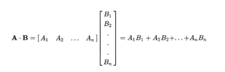
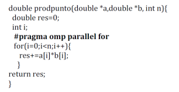

# Actividades

1. Dada una función que encuentra el máximo valor entero entre los elementos de un arreglo unidimensional de n elementos enteros, realizar una versión paralela.

   ```c
   int buscaMaximo(int *a, int desde, int hasta) {
        int max, i;
        max = a[ 0 ];
        for (i = desde; i < hasta; i++) {
            if (a[i] > max){
                max=a[i];
            }            
        }
        return max;
   }
   ```
    Analizar el problema. Ver que se puede realizar una descomposición de dominio o datos. En otras palabras, si se tienen varios hilos, cada uno puede buscar el máximo en un sub-arreglo del arreglo original, que le es asignado, y utilizar el mismo algoritmo de búsqueda sobre cada sub-arreglo.
    Utilizando la función del ejemplo que realiza la búsqueda, para dividir el arreglo entre los hilos cada uno debe empezar y terminar su índice del arreglo en diferente valor. Para conseguir esto con OpenMP, como vimos en los ejemplos de la Guía de Actividades 1, se utiliza el constructor for que divide el computo entre los hilos.
    ```C
    # pragma omp parallel
    {
      #pragma omp for
    //Se puede reunir en
    # pragma omp parallel for
    ```
    Importante: Cuando cada hilo trabaje con una parte del arreglo puede ser que al revisar si `a[i] > max` y dos de ellos actualizan max pueda ocurrir que se dé una race condition. Esto es posible, aunque las ejecuciones parezcan que están bien.

      La clausula `reduction(max:max_local)` especifica que cada hilo tendrá su propia copia de `max_local` que se inicializa con el valor del primer elemento de su sub-arreglo. Después de que todos los hilos hayan terminado, OpenMP combinará estos valores locales en uno global usando la operación máxima, lo que dará el máximo global del arreglo. Esto elimina la necesidad de una sección crítica y hace que el código sea más eficiente.

    ### Cláusula reduction
    Para conocer cómo opera esta cláusula pensemos un ejemplo: 
    Realizar el producto escalar entre dos vectores de n elementos cada uno, el cual se grafica a continuación:
    

    Para tener una solución paralela con hilos que cooperen en el cómputo se analizará dividir el cálculo entre los n hilos. Otra vez hay que repartir el arreglo en sub-arreglos y encontrar los índices en función del Id del hilo.
    La siguiente es una primera manera de paralelizarlo usando la cláusula for:
    

    - Implementar este código.
    - ¿Los resultados obtenidos son correctos?
    - ¿Cuál es la función de la variable RES?
    - Explique el comportamiento del algoritmo

    La variable `res` se utiliza para acumular el resultado del producto escalar de dos vectores. La `reduction(+:res)` en la directiva `#pragma omp parallel` indica que cada hilo debe tener su propia copia de `res`, y al final de la región paralela, se combinarán todos los valores de `res` de los diferentes hilos mediante una operación de suma de reduction. Esto significa que cada hilo realiza su propio cálculo parcial del producto escalar y al final, estos resultados parciales se suman para obtener el resultado final del producto escalar.
    Se inicia una región paralela con dos hilos utilizando `#pragma omp parallel reduction(+:res) num_threads(2)`. Cada hilo obtiene su número de identificación (tid) utilizando `omp_get_thread_num()`. El bucle for es paralelizado con `#pragma omp for`. Cada hilo ejecuta una porción del bucle, sumando el producto de los elementos correspondientes de los vectores a y b a su variable local `res`. Al final de la región paralela, se devuelve el valor acumulado de `res`, que representa el producto escalar de los dos vectores.

- Agregar constructor paralelo, compilarlo y ejercutar

  ```C
  #pragma omp parallel
  {
  	...
  }
  ```

  ```bash
  gcc (o g++) –o HelloWorldParallel HelloWorldParallel.c -fopenmp
  ./HelloWorldParallel
  ```

- ¿Qué diferencia hay en la salida? Explique en función del hardware sobre el que está ejecutando el programa.
  La directiva `#pragma omp parallel` indica que el bloque de código siguiente debe ejecutarse en paralelo. La diferencia en la salida radica en que, debido a la directiva OpenMP, el bloque de código dentro del `pragma #pragma omp` parallel se ejecutará en varios hilos simultáneamente. Entonces, las multiples lineas "Hello World" y las iteraciones del bucle se imprimen en un orden no secuencial, ya que varios hilos se ejecutan de manera concurrente y pueden imprimir su salida en un orden intercalado. El orden y la cantidad de lineas pueden variar dependiendo de cómo se maneje la ejecución en el hardware (según el Scheduler) en el que se está ejecutando el programa. Tambien toma relevancia la catidad de núcleos disponibles en el hardware. En sistemas con un solo núcleo, el programa se ejecutará secuencialmente y dará una salida igual a la del primer programa.

2.  En cada región paralela hay un número de hilos generados por defecto y ese número es igual al de unidades de procesamiento que se tengan en la computadora paralela que se esté utilizando, en este caso el número de núcleos que tenga el procesador.