# Algoritmo K-means / K-means Algorithm

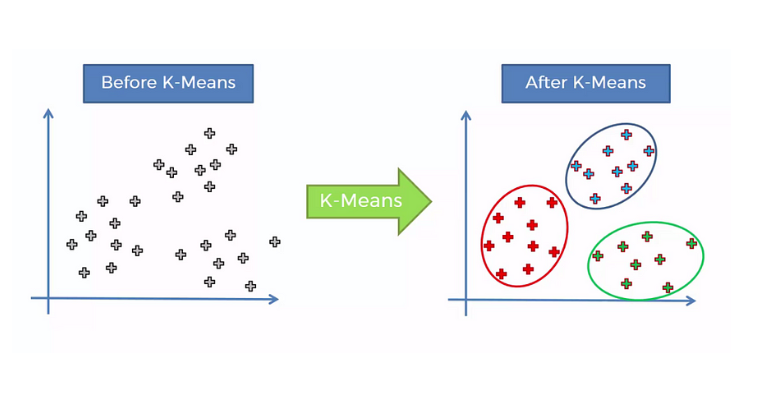

### What are clustering techniques? What is the K-means algorithm and what is it used for?

Currently, they are used as unsupervised machine learning techniques that consist of dividing data into distinct groups so that the observations within each group are similar. Here, each group is called a cluster.

In unsupervised learning, the expected outcome of the data used is unknown. However, the goal is to find/learn relationships, structures, and patterns underlying the provided input data.

The K-means algorithm is a widely used clustering technique in unsupervised learning to classify and divide a dataset into distinct groups (clusters) based on their features. It is useful for identifying patterns and underlying structures in complex data, facilitating its analysis and interpretation. Typically, the Euclidean distance is used. If the dataset is very large, Manhattan distance is recommended, and if the data has many categories, Cosine distance is recommended.

### How does the K-means algorithm work?

1. **Choosing the number K of clusters**: Choose the number K of clusters. For example, K=2.

   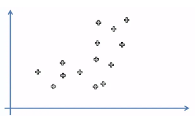

2. **Selecting initial centroids**: Select K random points as initial centroids (the centroid is the central point of the cluster).

   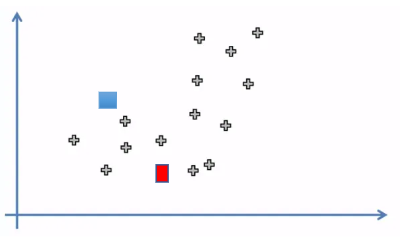

3. **Assigning points to centroids**: Assign each point to the nearest centroid. K groups of points are generated in such a way that the distance of all points to the centroid is minimized.

   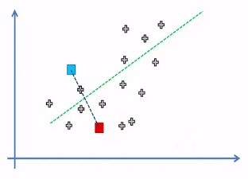

4. **Recalculating centroids and reassigning points**: Recalculate the position of the centroids considering all points in each group. Reassign the points to the new centroids. Repeat this step until there are no changes in the assignments.

   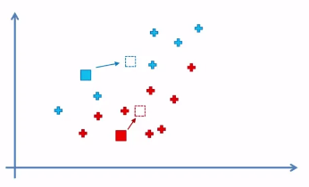 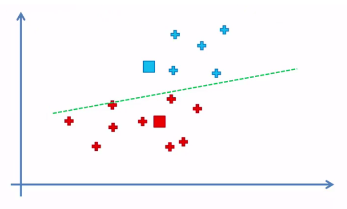

   Some points may change groups.

   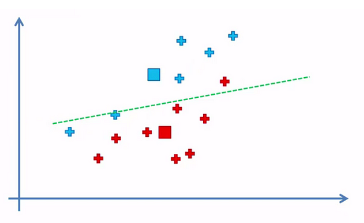 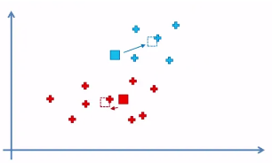

   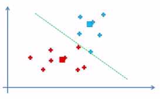 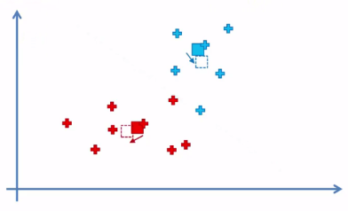

   When Step 4 is repeated and there are no more changes in the assignments, the iteration process is complete.

   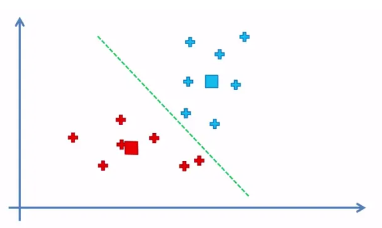 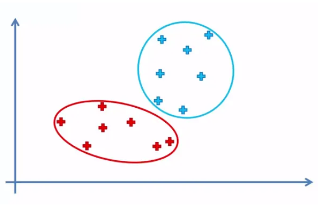

---

### Español

### ¿Qué son las técnicas de agrupamiento? ¿Qué es el algoritmo K-means y para qué sirve?

Actualmente, se utilizan como técnicas de aprendizaje automático no supervisadas que consisten en dividir datos en grupos distintos de modo que las observaciones dentro de cada grupo sean similares. Aquí, cada grupo se denomina cluster.

En el aprendizaje automático no supervisado se desconoce el resultado que se espera obtener con los datos utilizados. Pero se busca encontrar/aprender relaciones, estructuras y patrones subyacentes a partir de dichos datos de entrada proporcionados.

El algoritmo K-means es una técnica de agrupamiento ampliamente utilizada en el aprendizaje no supervisado para clasificar y dividir un conjunto de datos en grupos distintos (clusters) basados en sus características. Es útil para identificar patrones y estructuras subyacentes en datos complejos, facilitando su análisis e interpretación. Normalmente, se usa la distancia euclídea. Si el conjunto de datos es muy grande, se recomienda la distancia Manhattan y si los datos tienen muchas categorías, se recomienda la distancia Coseno.

### ¿Cómo funciona el algoritmo K-means?

1. **Elección del número K de grupos (clusters)**: Elija el número K de grupos. Por ejemplo, K=2.

   

2. **Selección de centroides iniciales**: Seleccione K puntos aleatorios como los centroides iniciales (el centroide es el punto central del grupo).

   

3. **Asignación de puntos a los centroides**: Asigne cada punto al centroide más cercano. Se generan K grupos de puntos de manera que se minimice la distancia de todos los puntos al centroide.

   

4. **Recalculación de centroides y reasignación de puntos**: Calcule nuevamente la posición de los centroides considerando todos los puntos de cada grupo. Reasigne los puntos a los nuevos centroides. Repita este paso hasta que no haya cambios en las asignaciones.

    

   Puede suceder que algunos puntos cambien de grupo.

    

    

   Cuando se repite el Paso 4 y no hay más cambios en las asignaciones, se da por terminado el proceso de iteración.

    
